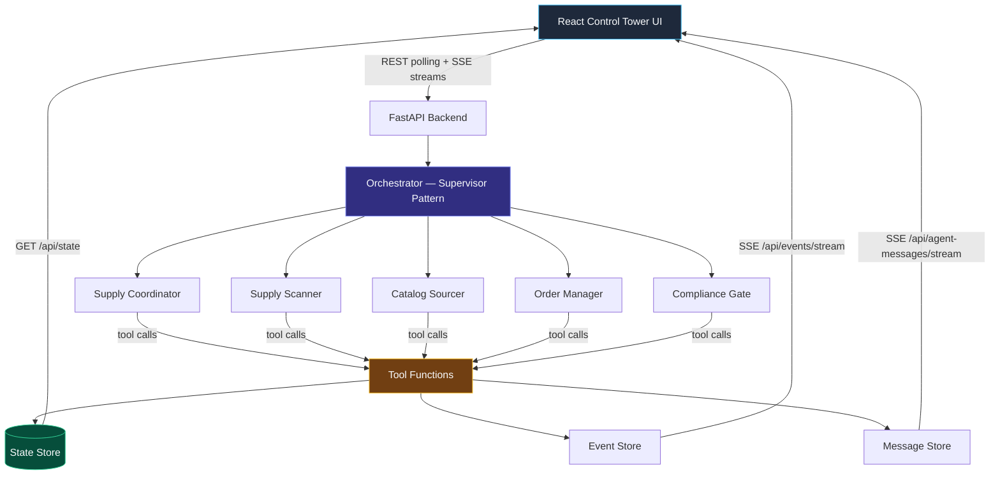

# Architecture

Technical deep dive into how the Supply Closet Replenishment demo is built.

## System Overview



## Key Design Decisions

### Supervisor Pattern

The orchestrator acts as a central dispatcher. The Supply Coordinator is the "supervisor" — it aggregates relevant signals, surfaces recommendations, and delegates to specialist agents. All inter-agent communication routes through the orchestrator, never directly agent-to-agent.

This makes the agent workflow observable: every delegation and response shows up in the Agent Conversation panel.

### Tool-Backed Mutations

Agents **cannot** modify state directly. They call named tools like `create_purchase_order`, `update_inventory`, `check_compliance`, etc. The orchestrator dispatches these calls to deterministic functions in `src/api/app/tools/tool_functions.py`.

Why: This gives us an audit trail, enforces state machine validation on every transition, and means agents can only do things we've explicitly allowed.

### In-Memory State

All state (items, closets, purchase orders, vendors) lives in memory. There is no database. State is seeded on startup and reset when a scenario triggers.

Why: This is a demo. Simplicity over durability. The state store uses async locks for thread safety and enforces valid state transitions (e.g., a scan can go INITIATED → ANALYZING but not INITIATED → COMPLETE directly).

### Event Sourcing Lite

Every state mutation emits an event to the Event Store. Events are append-only with monotonic sequence numbers. The UI subscribes to an SSE stream to receive events in real time.

This is "lite" because we don't rebuild state from events — the State Store is the source of truth, and events are a side effect for observability.

### Dual Mode (Simulated vs Live)

The orchestrator auto-detects which mode to use:

- **No Azure config** → Simulated mode: scripted tool call sequences that walk through the demo flow deterministically
- **`PROJECT_ENDPOINT` or `PROJECT_CONNECTION_STRING` set** → Live mode: real Azure AI Foundry agents with GPT-5.2 making decisions

Both modes use the same tool functions, state store, and event system. The only difference is who decides which tools to call.

## Data Model

### Entities

| Entity | Key Fields | State Machine |
|--------|-----------|---------------|
| **SupplyItem** | id, sku, name, closet_id, category, criticality, par_level, current_quantity | Tracked by quantity vs par_level thresholds |
| **PurchaseOrder** | id, items, vendor_id, state, total_cost | CREATED → PENDING_APPROVAL → APPROVED → SUBMITTED → CONFIRMED → SHIPPED → RECEIVED (+ CANCELLED branch) |
| **Vendor** | id, name, contract_tier, lead_time_days | GPO_CONTRACT / PREFERRED / SPOT_BUY |
| **SupplyCloset** | id, name, floor, unit, location | Container for supply items |

### Events

Events are immutable records with: `id`, `sequence`, `timestamp`, `event_type`, `entity_id`, `payload`, and optional `state_diff`.

Event types cover the full lifecycle: `ScanCompleted`, `POCreated`, `POStateChanged`, `ShipmentDispatched`, `RestockComplete`, etc.

### Agent Messages

Each message includes: `agent_name`, `agent_role`, `content`, `intent_tag`, and `timestamp`. Intent tags categorize the action: `PROPOSE`, `VALIDATE`, `EXECUTE`, `ESCALATE`.

## Tool Functions

15 registered tools, split into read-only and mutation:

**Read-only:** `get_scan`, `get_items`, `get_vendors`, `get_purchase_orders`, `get_shipments`

**Mutation:** `initiate_scan`, `analyze_scan`, `lookup_vendor_catalog`, `create_purchase_order`, `approve_purchase_order`, `submit_purchase_order`, `create_shipment`, `receive_shipment`, `publish_event`, `escalate`

Each agent has a scoped set of tools defined in `src/api/app/tools/tool_schemas.py`. The Supply Coordinator gets everything; specialist agents get only what they need.

## API Endpoints

| Method | Path | Purpose |
|--------|------|---------|
| GET | `/health` | Health check for container probes |
| GET | `/api/state` | Full state snapshot (polled every 2s by UI) |
| GET | `/api/events` | Event list (with `since` param) |
| GET | `/api/events/stream` | SSE stream of events |
| GET | `/api/agent-messages` | Message list (with `since` param) |
| GET | `/api/agent-messages/stream` | SSE stream of agent messages |
| POST | `/api/scenario/seed` | Reset state and seed initial supply closet data |
| POST | `/api/scenario/routine-restock` | Trigger routine restock (returns 202) |
| POST | `/api/scenario/critical-shortage` | Trigger critical shortage scenario (returns 202) |

## Frontend Architecture

React 18 + TypeScript + Tailwind CSS + Vite.

- **`useApi` hook** — Polls `/api/state` every 2 seconds for inventory/order/shipment state
- **`useSSE` hook** — Maintains persistent SSE connections for real-time events and agent messages
- **Three-pane layout** — `ControlTower` component splits into Ops Dashboard (left, 55%) and Agent Conversation + Event Timeline (right, 45%)
- **ScenarioToolbar** — Trigger buttons for scenarios + connection status indicator

## Infrastructure (Azure)

Provisioned via Bicep in `infra/`:

| Module | Resources |
|--------|-----------|
| `foundry.bicep` | AI Services, AI Hub, AI Project, model deployment |
| `aca.bicep` | Container Registry, Container App Environment, Container App, RBAC |
| `observability.bicep` | Log Analytics workspace, Application Insights |

Single-container deployment: the Docker image serves both the FastAPI API and the static React build.

## Project Structure

```
├── azure.yaml                      # azd project config
├── Dockerfile                      # Multi-stage build (React → Python)
├── infra/
│   ├── main.bicep                  # Orchestrates all modules
│   └── modules/
│       ├── foundry.bicep           # AI Foundry resources
│       ├── aca.bicep               # Container Apps + registry
│       └── observability.bicep     # Logging + monitoring
├── scripts/
│   ├── build_agents.py             # Creates/updates Foundry agents
│   └── smoke_test.sh               # Post-deploy health check
└── src/
    ├── api/
    │   ├── app/
    │   │   ├── agents/
    │   │   │   ├── orchestrator.py # Dual-mode orchestration engine
    │   │   │   └── prompts/        # 5 agent system prompts
    │   │   ├── events/             # Event store + SSE
    │   │   ├── messages/           # Message store + SSE
    │   │   ├── models/             # Pydantic models, enums, transitions
    │   │   ├── routers/            # FastAPI route handlers
    │   │   ├── state/              # In-memory state store + seed data
    │   │   └── tools/              # Tool implementations + JSON schemas
    │   └── tests/                  # pytest suite
    └── ui/
        └── src/
            ├── components/         # Dashboard, Conversation, Timeline
            ├── hooks/              # useApi, useSSE
            └── types/              # TypeScript interfaces
```
